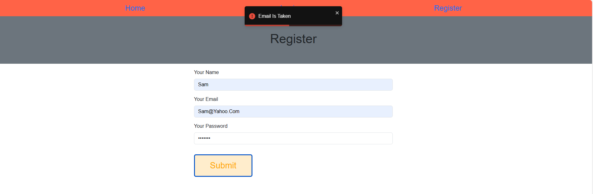

# HTTP5222- MERN Stack Assignment

## I am building a website that allows users to create a Stripe connect account. This is typically used for online marketplaces or platforms that need to facilitate payments between buyers and sellers.

## Website should be allow users to:
  - Register and log in to an account
  - Create and manage hotel listings (as a seller)
  - Browse and book hotel rooms (as a buyer)
## Website have the following features:
   - User authentication and authorization
   - Hotel listing management (create, edit, delete)
   - Booking system (browse, book, and manage bookings)
   - Stripe integration for payment processing
   - Dashboard for sellers to manage their hotel listings and bookings
   - Dashboard for buyers to view their bookings and browse hotels

**The website is built using React, Redux, and MongoDB, with a Node.js backend. It uses React Router for client-side routing and React Toastify for displaying notifications.**

## Installation
1. Clone this repository: ```git clone https://github.com/abiasV/HTTP5222-Assignment.git```
2. Navigate to the project directory: ```cd HTTP5222-Assignment```
3. Run in Server side: ``` npm i (to install node_module package)```
                       ``` npm start```
4. Run in Client side: ``` npm i (to install node_module package)```
                       ``` npm run dev```


## Live Website


